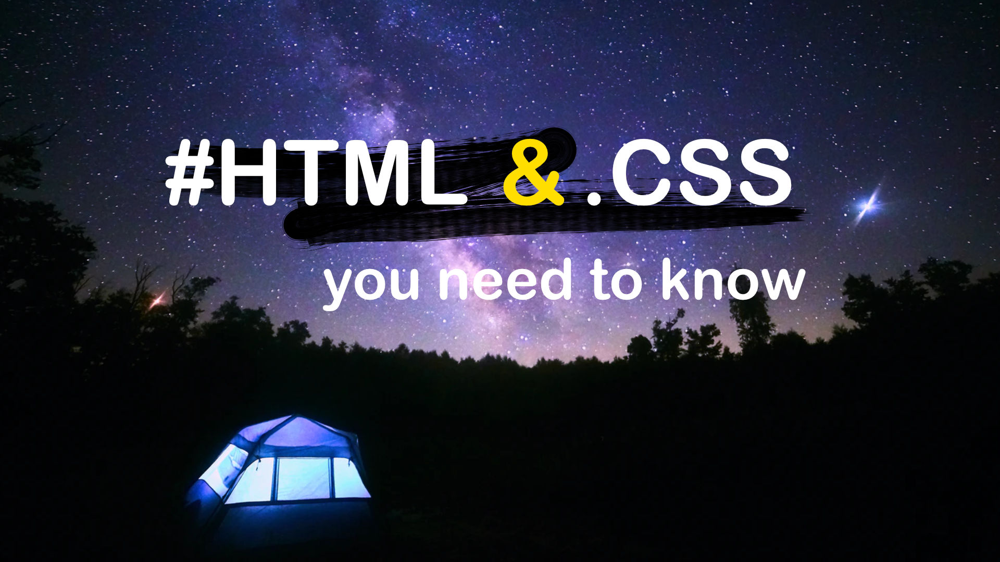

# 2020 HTML & CSS Free Video Training Course

by George Antohi of UXDVerse.com

[UXDVerse - YouTube](https://www.youtube.com/channel/UCdllgVaWIDGjM1bxUBXwKrQ)

https://twitter.com/cdwithgeorge

---

### Course Length

More than **16h** in 1080p over YouTube.

In this course you will learn all the necessary HTML and CSS you need to know to start creating web app design and pages and get a new job as a web designer and developer.

### What will  you learn?

- HTML5 and CSS

- How to use Firefox Developer Tools

- How to work with Visual Studio Code to create and edit your pages

- Learn about the Visual Studio market place for Extensions

- Learn to use DuckDuckGo.com search engine in the development cycle

### Course Prequisites

Download and install the required software as follows.

- **Firefox Browser** - [Firefox - Protect your life online with privacy-first products — Mozilla](https://www.mozilla.org/en-US/firefox/)

- **Visual Studio** -[ https://code.visualstudio.com/](https://code.visualstudio.com/)

### Course Dowloadables

Code baseline for the lessons, startign with lesson 23.

ZIP files are available for download either from GitHUB direcly  inside **course_lessons** folder or via GDrive.

[HTML_and_CSS_you_need_to_know - Google Drive](https://drive.google.com/drive/folders/15u8kIThFiGG1KrnoaAJHGl0U6Bugm4aa?usp=sharing)

- Download the lesson's baseline code as .zip

- Extract the content in a folder

- Open the index.html or required file inside Firefox or your preffered browser

- Open the project's folder inside Visual Studio Code

## Table of Contents

1. [Introduction - Part 1](https://youtu.be/sUot6XDmPks)

2. [HTML document and basic blocks](https://youtu.be/9sWsy7WHOoI)

3. [Adding CSS to our HTML document](https://youtu.be/vH4vJBA2PnA)

4. [CSS Box Model, Padding, Border, Margin](https://youtu.be/5Mnb3ChcUqY)

5. [Adding Images in HTML](https://youtu.be/ZyVpo0b8Wg4)

6. [CSS Classes, Inline Style, Border Radius - Part 6 - YouTube](https://youtu.be/Z2hNjKPgKSA)

7. [CSS Inheritance, Base Font Size](https://youtu.be/cr2jJFOcHtc)

8. [Adding Fonts to Web Page - Part 1](https://youtu.be/h5MPt8DmXGM)

9. [Adding Fonts to Web Page - Part 2](https://youtu.be/mpulTp9VGIc)

10. [CSS Specificity, Level of Importance](https://youtu.be/blF1hay20WY)

11. [Adding a Background Image in HTML and CSS, Auto Center an Element](https://youtu.be/NOmuU3sjC0Y)

12. [Types of Images in HTML - Part 12 - YouTube](https://youtu.be/6W__ltuoGxg)

13. [Images and Text Alignment](https://youtu.be/cFq9g_2CRaY)

14. [Web Colors and How To Use Colors in HTML and CSS - Part 14 - YouTube](https://youtu.be/xTKUA4TG5rI)

15. [HTML DOCTYPE and Meta](https://youtu.be/VhDd4yONwmA)

16. [HTML Text Style Elements](https://youtu.be/cNOlno9jnTY)

17. [Adding CSS to HTML, advanced](https://youtu.be/N3QZXw6H7_4)

18. [CSS Class Construction and using !Important](https://youtu.be/y8d-q3APrIk)

19. [HTML and CSS Naming Conventions](https://youtu.be/11qQhnognpc)

20. [CSS Units of Measurement (px, pt, em, rem, %, vh, vw)](https://youtu.be/V6REkZtK13s)

21. [CSS Float and Columns - Part 1](https://youtu.be/k015QuDjhd4)

22. [CSS Float and Columns - Part 2](https://youtu.be/CJ61-suieU4)

23. [CSS Box Sizing and Negative Margins - Part 23 - YouTube](https://youtu.be/sij8tvntu7A)

24. [HTML Navigation, Absolute URLs and Images as Links - Part 1](https://youtu.be/5r7Wbe0gNl4)

25. [HTML Navigation, Relative URLs and Page Navigation - Part 2](https://youtu.be/ckOeCsgZsBA)

26. [HTML Navigation, Browser History - Part 3](https://youtu.be/JfhdlknIpXY)

27. [HTML Navigation, Links mailto: and tell: - Part 4](https://youtu.be/rG3xwYTT2sM)

28. [Styling HTML Links with Pseudo-classes](https://youtu.be/-MdPu-g4TQY)

29. [HTML5 Elements: main, article, section, header, footer, nav](https://youtu.be/sZAtCqt7oAE)

30. [HTML Unordered, Ordered lists and Description Lists: ul, ol, dl](https://youtu.be/erslWz2rXK4)

31. [Styling Text With CSS](https://youtu.be/9m7ie-WSRQ8)

32. [Relative and Absolute Position in CSS](https://youtu.be/c7t84ziVHiw)

33. [HTML Table, Thead, Tbody, Tfoot, Row, Cell - Part 1](https://youtu.be/VRcRYLyKdic)

34. [HTML Table properties and values - Part 2](https://youtu.be/OBf-_nKyWqg)

35. [HTML5 Video and Audio elements - Part 35 - YouTube](https://youtu.be/H7v8sjwLTrc)

36. [HTML Entities](https://youtu.be/CC3PGShQ8f0)

37. [HTML Iframe](https://youtu.be/kPE4O7_B4YU)
